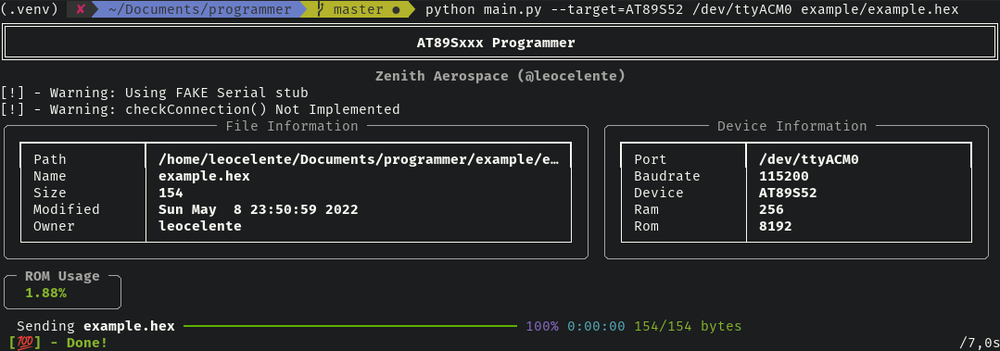

# AT89Sxxx Programmer
** Tool to program AT89S family of 8051 microcontrollers using the SPI interface**



## Description and Motivation
A python script that reads an Intel Hex file, compiled from SDCC. Communicates with
another device, usually an Arduino via Serial (UART). The device transforms commands
from the serial interface to SPI that writes the firmware to the target (8051).

That setup was not really a choice. This project was just intended to replace 
an .NET program that originally communicated with the arduino. That program was
terribly buggy and not cross-platform. I chose to keep the convoluted setup to 
not risk encountering hidden bugs that were only solved through trial and error.
<details>
  <summary>If I were to create a solution from scratch, I would do things differently</summary>

  If one were to re-implement the flashing process inside an Wi-Fi enabled microcontroller,
  such as a ESP32, they could receive the hex file wirelessly. That would remove the need
  for protocol translation and the cables connected to the development PC.
</details>


## Dependencies
 - pySerial: `pyserial`
 - IntelHex: `intelhex`
 - Rich: `rich`

To install them at once use: `pip install -r requirements.txt`

Don't forget to flash the arduino with the firmware in `device/device_firmware`.

## Usage
```shell
usage: Programmer [-h] [--version] [--target <TARGET>] <PORT> <HEXFILE>

Serial Programmer for the AT89Sxx series of microcontrollers

positional arguments:
  <PORT>             Serial Port destination
  <HEXFILE>          Hex File source

optional arguments:
  -h, --help         show this help message and exit
  --version          show program's version number and exit
  --target <TARGET>  Target Model from supported list 
```

Example:
First, compile the example C project. 
```shell
$ cd example
$ make
& cd .. 
```

That should provide us a `example.hex` file (along with a bunch of other files)
Once you have the target's firmware at hand, find which serial port the device (Arduino)
is connected. The easiest way is with the Arduino IDE. The only thing left is optional,
you can supply the script with the target model. 

Supposing the serial port is `/dev/ttyACM0`, to start the process run:
```shell
$ python main.py --target=AT89S52 /dev/ttyACM0 example/example.hex
```
